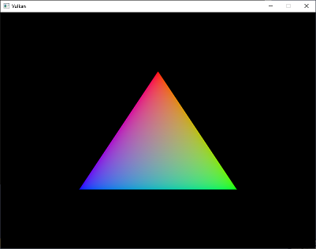

# Vulkan-Triangle
- Reference: https://vulkan-tutorial.com
- Display triangle using Vulkan.

## OS and Library version
- Windows10
- Visual Studio 2019
- VulkanSDK:1.2.135.0
- glfw:3.3.2
- glm:0.9.9.8

### VulkanTriangle
- Display triangles using Vulkan.

### VulkanTriangle-shaderc
- Compile the shader code and display the triangles.

